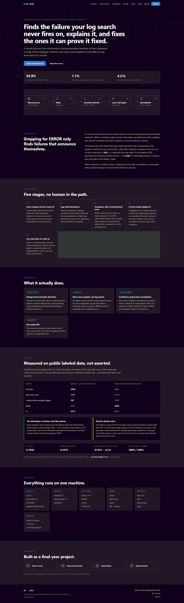
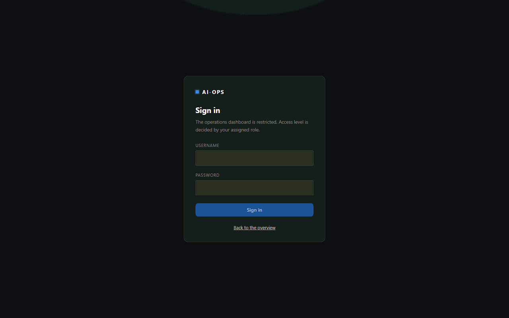
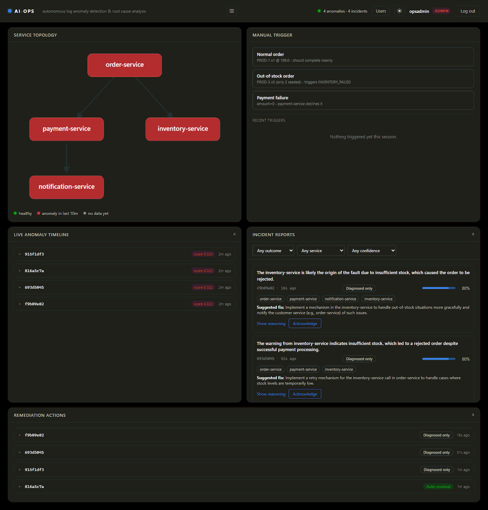
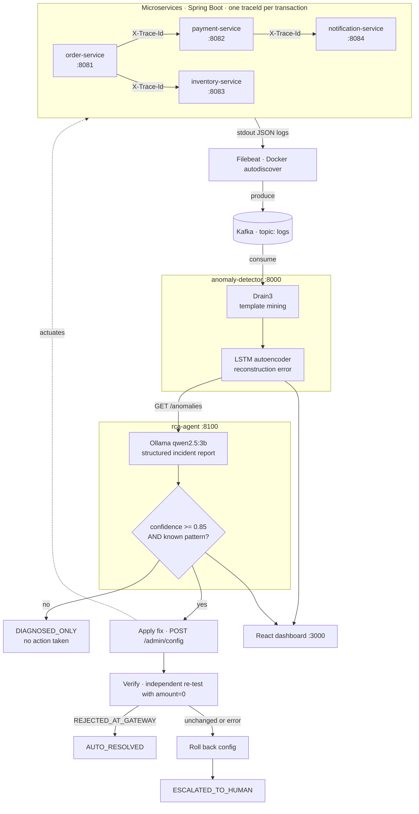

# AI-Ops: Autonomous Log Anomaly Detection & Root Cause Analysis

**A self-hosted system that detects microservice failures, diagnoses their root cause with a local LLM, and — for a known failure pattern — applies a real fix, verifies it worked, and rolls back if it didn't. Zero paid APIs; everything runs on one laptop.**

---

## Team

Built by **Pawar Yuvraj**, **Aditya Suryawanshi**, **Aalok Nikam**, and **Aditya Pawade** — 7th Semester B.Tech CSE, MIT School of Computing, MIT-ADT University, Pune. Team ID: BCC31. Guide: Prof. Karan Mashal.

---

## The problem

In a microservice architecture, every service logs independently. When a request fails, the evidence is scattered across four different log streams with no shared thread tying them together, so an engineer has to manually correlate timestamps across services to reconstruct what happened. Worse, the failures that matter most are often *logic-level*: nothing crashes, no stack trace appears, and a keyword alert on `ERROR` sees nothing at all — an order is silently declined, a step is skipped, a call quietly gets slower. Those are invisible to grep and expensive to find by hand.

This project builds the full loop that closes that gap: correlate, detect, diagnose, and — where it is safe to do so — fix.

---

## What it does

- **Distributed tracing across 4 real microservices** — a `traceId` is generated at the gateway and propagated across every service hop, so one business transaction is recoverable as a single ordered sequence.
- **Real-time log streaming** — structured JSON logs are shipped off every container and into a central Kafka topic without any application code changing to support it.
- **ML-based anomaly detection, not keyword matching** — Drain3 mines raw log lines into stable templates, and an LSTM autoencoder trained *only on normal traffic* scores each trace by reconstruction error. It flags sequences that are structurally unusual, including ones where no line says "ERROR".
- **AI root cause analysis, fully local** — a quantized 3B model (Ollama + `qwen2.5:3b`) receives the trace, the service dependency graph, and the anomaly score, and returns a structured incident report: root cause, affected services, confidence, suggested fix, and its reasoning.
- **Closed-loop auto-remediation** — for a demonstrated failure pattern, the agent applies a real configuration fix, **independently re-tests** to confirm the fix actually worked, and **automatically rolls back** if verification fails. Every action is gated behind a confidence threshold, so low-confidence diagnoses are never acted on.
- **Live operations dashboard** — service topology with health coloring, an anomaly timeline with full log context, incident report cards, a remediation audit log, and one-click buttons to trigger real failures for demos.

---

## Screenshots

**Landing page** — the public overview at `/`, with the animated pipeline diagram and the measured HDFS comparison.



**Sign in** — `/login`. Access is role-based and enforced on the backend; the credentials are whatever you set in your own `.env`.



**Operations dashboard** — `/app` as an ADMIN: service topology, live anomaly timeline, incident report cards with confidence meters, the remediation audit log, and the trigger panel.



ENGINEER sees the same feeds without the trigger panel; VIEWER additionally loses the acknowledge buttons. A dark/light toggle sits in the header.

---

## Architecture



The remediation path is the part worth reading closely: the agent does not stop at *suggesting* a fix. It applies one, proves it worked with a test it runs itself, and undoes its own change if the proof fails.

---

## Tech stack

| Layer | Technology |
|---|---|
| Microservices | Java 17, Spring Boot 3.3.2 |
| Distributed tracing | SLF4J MDC + servlet filter + `RestTemplate` interceptor (hand-rolled) |
| Structured logging | Logback + `logstash-logback-encoder` (JSON to stdout) |
| Log shipping | Filebeat 8.13.4 (Docker autodiscover, `json-file` driver) |
| Message bus | Apache Kafka 7.6.1 (Confluent images) + ZooKeeper |
| Log parsing | Drain3 0.9.11 (online log template mining) |
| Anomaly detection | PyTorch 2.3.1 — LSTM sequence autoencoder (CPU) |
| LLM inference | Ollama + `qwen2.5:3b`, fully local |
| Backend services | Python 3.11, FastAPI 0.111, `kafka-python` |
| Frontend | React 18.3, Vite 5.4, served by nginx 1.27 |
| Orchestration | Docker Compose — 13 services on one bridge network |

---

## Proof it works

These are figures observed in real runs of the system, not projections. The trained model, its threshold, and the Drain3 state are all committed, so a fresh clone reproduces this behavior without retraining.

**Anomaly detection**
- Model: LSTM autoencoder, **16,259 trainable parameters**, 68 KB on disk — small enough to train on a laptop CPU in seconds.
- Trained on **1,000 captured trace sequences** of deliberately varied normal traffic, with a separate 300-trace validation set used to pick the threshold.
- Threshold rule: `max(validation p99, validation mean + 3σ)` — chosen without ever looking at anomalous data.
- Measured against labeled faults rather than asserted; see **[Results](#results)** below.

**Root cause analysis**
- The local 3B model produced correct, well-reasoned reports — e.g. correctly identifying `inventory-service` as the origin of an out-of-stock cascade at **0.90 confidence**, listing all four affected services in call order, and proposing a relevant fix.
- Observed confidence across runs ranged **0.80 – 1.00** on the same failure pattern, which is exactly why actions are gated rather than assumed correct.

**Closed-loop remediation — all three outcomes demonstrated live**

| Outcome | How it was demonstrated | Result |
|---|---|---|
| `AUTO_RESOLVED` | High-confidence diagnosis → applied gateway fix → independent re-test returned `REJECTED_AT_GATEWAY` | Fix verified working; a subsequent unrelated request was correctly rejected |
| `DIAGNOSED_ONLY` | A real run where the LLM returned **0.80 confidence**, below the 0.85 action threshold | System correctly took **no action** and logged why — the safety gate firing on its own, unprompted |
| `ESCALATED_TO_HUMAN` | (a) fix could not be applied at all; (b) fix applied but re-test still showed old behavior | (a) escalated with nothing to undo; (b) **config automatically rolled back**, then escalated |

Every attempt — including the ones where it declined to act — is written to an auditable `remediationLog` with the request and response bodies of each step.

**Cost and privacy**
- Runs entirely on the host. No API keys, no recurring cost, and no log data leaves the machine.

---

## Results

Measured, not asserted. Full methodology, confusion matrices, plots and the list of superseded runs are in **[benchmark/RESULTS.md](benchmark/RESULTS.md)**.

### Public labeled dataset — LogHub HDFS_v1

50,000 blocks (1,464 anomalous, the natural 2.93% rate), held-out test of 9,708 normal / 1,464 anomalous. Thresholds picked on training/validation normals only; test labels never used to select an operating point.

**ROC-AUC 0.7930 · Average precision 0.5974**

| | LSTM (validation-p99) | Keyword baseline |
|---|---|---|
| Precision | **0.839** | 0.304 |
| Recall | 0.374 | **0.656** |
| F1 | **0.517** | 0.416 |
| **False-positive rate** | **1.1%** | **22.7%** |

**The LSTM's advantage is precision and false-alarm rate, not recall — and its recall is plainly lower.** Keyword matching catches more anomalies (0.656 vs 0.374) but flags **2,200 of 9,708 healthy blocks**; the LSTM flags **105**. That is a ~**21× reduction in false alarms** at 2.8× the precision. A detector that fires on a quarter of healthy traffic gets muted within a week, which is why the false-alarm axis is the one that decides whether a detector survives contact with an on-call rota. The LSTM also wins at matched recall: at the baseline's own 0.656 recall it reaches precision 0.350 vs 0.304.

Honest caveat: ROC-AUC 0.79 is **moderate, not strong**. A 16K-parameter model transferred to a foreign domain — with second-resolution timestamps and sequences truncated at 16 events on ~19-line blocks — is well short of purpose-built HDFS detectors, which reach F1 > 0.9.

### End-to-end fault injection — this system

400 labeled orders (300 normal + 4 fault types × 25) through the live stack, with remediation disabled so it cannot alter the measurement. Pipeline integrity gate: **100% delivery, 100% assembly, 0 split closures.**

| | **v1 (shipped default)** | v2 (experimental, opt-in) | Keyword |
|---|---|---|---|
| Precision | 0.8889 | 0.9009 | **1.0000** |
| Recall | 0.8000 | **1.0000** | 0.7500 |
| F1 | 0.8421 | **0.9479** | 0.8571 |
| FPR | **3.3%** | 3.7% | **0.0%** |

| Fault type | **v1** | v2 | Keyword |
|---|---|---|---|
| `amount_zero` | 1.000 | 1.000 | 1.000 |
| `notification_down` | 1.000 | 1.000 | 1.000 |
| `out_of_stock` | 1.000 | 1.000 | 1.000 |
| **`inventory_latency`** | 0.200 | **1.000** | 0.000 |

On *this* system the keyword baseline is genuinely strong — zero false positives — because four small services with a disciplined log vocabulary only emit WARN/ERROR on real failures. The LSTM's margin over it comes almost entirely from **`inventory_latency`, the one fault that emits no WARN or ERROR line at all**: the silent, logic-level failure this project exists to catch. The contrast with HDFS, where the same baseline had a 22.7% false-positive rate, shows how much its apparent strength depends on log hygiene.

**v1 is the shipped default; v2 is an experimental alternative feature set, off by default.** v2 replaces the saturating inter-arrival squash with `log1p(dt)` and adds a trace-duration channel, which is why it catches all 25 latency faults where v1 catches 5. Enable it with:

```bash
FEATURE_VERSION=v2 \
MODEL_PATH=/app/models/lstm_autoencoder_v2.pt \
THRESHOLD_PATH=/app/models/threshold_v2.json
```

### Why v2 is not the default

v2 passed a promotion rule fixed in advance (FPR within 2 points of v1 — it was +0.33 — and latency recall above 0.80 — it was 1.000), was promoted, and was then reverted after a fresh-clone check on a freshly started stack:

| Check | v2 | v1 |
|---|---|---|
| First (cold) order after `docker compose up` | **flagged** | **not flagged** |
| 12 warm normal orders | **1 of 12 flagged** | **0 of 12 flagged** |

The cold-start trace v2 flagged was structurally perfect — 10 events, correct ordering, all INFO — just slow (0.253 s total against ~0.018 s warm) because the JVM had been up for nine seconds. Timing sensitivity is v2's whole premise, so routine warm-up reads as an anomaly, and on a demo the very first order would likely be flagged.

**This comparison has a memory confound.** The v2 check ran with Docker capped at 7.6 GB, which was actively OOM-killing containers (`exit 137` on `kafka` and `anomaly-detector`). The v1 check ran at a 10 GB cap and passed the identical sequence. A memory-starved host slows JVM startup and GC — precisely the signal v2 keys on — and **v2 was not retested at 10 GB**, so this should not be read as a clean verdict on v2.

**The lesson is about the rule, not the model.** The promotion rule was *relative* ("within 2 points of v1") with **no absolute false-positive ceiling**, and Part B warms the stack with hundreds of orders before measuring, so cold-start traffic was never in the evaluation set at all. A relative rule cannot catch a model whose errors concentrate in a regime the benchmark does not sample.

**These fault-injection figures come from a single 400-order run, and that same run informed the v2 promotion decision** — it is not an independent hold-out, so the v2 F1 of 0.9479 is a single-run, promotion-time measurement of an experimental configuration, not a validated generalization estimate. The false-positive rate is especially noisy at this sample size: v1's FPR ranged 0.7%–5.0% across runs under identical protocol, so treat all FPR figures as ±2 points. The HDFS numbers above *are* a proper held-out evaluation.

---

## Quick start

**Prerequisites:** Docker Desktop (or Docker Engine + Compose v2), **about 10 GB of memory available to Docker**, and 5 GB free disk.

> **Raise the Docker memory cap before the first `up`.** The full stack is thirteen Compose services — eleven long-running plus two one-shot init containers — including a JVM per microservice alongside Kafka, Zookeeper and Ollama. Docker Desktop's default WSL2 cap of roughly 7.6 GB was **not** enough here — `kafka` and `anomaly-detector` were OOM-killed (`exit 137`) mid-run and Docker Desktop itself crashed twice. On Windows, create or edit `C:\Users\<you>\.wslconfig`:
>
> ```ini
> [wsl2]
> memory=10GB
> swap=4GB
> ```
>
> then apply it — this stops every WSL distro, so close other WSL terminals first:
>
> ```powershell
> wsl --shutdown
> ```
>
> Restart Docker Desktop and confirm the new cap with `docker info --format "{{.MemTotal}}"` (expect ~10.4e9, not ~7.6e9). On Docker Desktop for macOS the equivalent setting is *Settings → Resources → Memory*.

**Create the environment file first.** Every secret comes from `.env`, which is gitignored; nothing is hardcoded and no service will start without it.

```bash
git clone https://github.com/yuvrajpawar09/AI-Ops.git
cd AI-Ops
cp .env.example .env
```

Then edit `.env` and replace all four values. The example values are deliberately rejected, so the stack refuses to start until you do:

| Variable | Required | Used by | Notes |
|---|---|---|---|
| `JWT_SECRET` | yes | rca-agent (signs), anomaly-detector (verifies) | >= 32 chars; both services must see the same value. `openssl rand -hex 32` |
| `SERVICE_API_KEY` | yes | rca-agent, order-service, inventory-service, benchmark scripts | >= 16 chars; guards `/admin/**`. `openssl rand -hex 24` |
| `ADMIN_USERNAME` | yes | rca-agent | >= 3 chars; the first ADMIN account, seeded only when the users table is empty |
| `ADMIN_PASSWORD` | yes | rca-agent | >= 8 chars; bcrypt-hashed on first boot and never stored in plaintext |
| `JWT_TTL_MINUTES` | no | rca-agent | session lifetime, default 30 |
| `SESSION_COOKIE_SECURE` | no | rca-agent | default `false`; set `true` only behind HTTPS, or the browser drops the cookie and login fails silently |

```bash
openssl rand -hex 32   # JWT_SECRET
openssl rand -hex 24   # SERVICE_API_KEY
```

Pick your own `ADMIN_USERNAME` and `ADMIN_PASSWORD` — they are yours alone, nothing in this repo ships a default account or a known password. Changing them later does not alter an account that already exists; use the dashboard's **Users** page instead.

```bash
docker compose up -d --build
```

**The default is CPU and needs no GPU runtime.** If you have an NVIDIA GPU, add the override to run the LLM on it:

```bash
docker compose -f docker-compose.yml -f docker-compose.gpu.yml up -d --build
```

That cuts an incident report from ~47 s to ~4 s (measured, [benchmark/RESULTS.md](benchmark/RESULTS.md)). Without an NVIDIA container runtime the override will fail to start, so use the plain command above.

On the **first run only**, a helper container pulls the `qwen2.5:3b` model (~2 GB) into a named Docker volume. This takes a few minutes; the dashboard and detection pipeline come up before it finishes, and the RCA agent waits for it automatically.

Watch for everything to become healthy:

```bash
docker compose ps
```

Then open **<http://localhost:3000>** for the overview page, sign in at **/login** with the `ADMIN_USERNAME` / `ADMIN_PASSWORD` you put in `.env`, and click a trigger button under **Manual Trigger**.

Roles are enforced on the backend, not just hidden in the UI:

| Role | Can do |
|---|---|
| **ADMIN** | Everything: view all feeds, acknowledge incidents, use the trigger panel, create users and change roles. |
| **ENGINEER** | View all feeds and acknowledge incidents. `403` on the trigger endpoint and on user management. |
| **VIEWER** | Read-only. `403` on anything that writes. |

Create additional accounts from the **Users** page in the header (ADMIN only).

> **No training step required.** The trained model, threshold, and Drain3 template state are committed, so anomaly detection is live on first boot. To retrain on your own traffic instead:
> ```bash
> docker compose run --rm anomaly-detector python -m training.train
> docker compose restart anomaly-detector
> ```

**Service endpoints**

| Service | URL | Auth |
|---|---|---|
| Dashboard | <http://localhost:3000> | public landing page; `/app` needs a session |
| Sign in | `POST http://localhost:3000/api/rca/auth/login` | sets an httpOnly `SameSite=Strict` session cookie |
| Orders API | `POST http://localhost:8081/orders` | open — this is the application's own API |
| Anomalies | <http://localhost:8000/anomalies> | session cookie or `X-Service-Key` |
| Incident reports | <http://localhost:8100/incidents> | session cookie |
| Trigger test orders | `POST http://localhost:8100/trigger` | session cookie, ADMIN only |
| Runtime config | <http://localhost:8081/admin/config> | `X-Service-Key` |
| Inventory admin | `http://localhost:8083/admin/restock`, `/admin/inventory` | `X-Service-Key` |

The browser never calls ports 8000 or 8100 directly. nginx in the dashboard container reverse-proxies `/api/detector` and `/api/rca` to them, which is what keeps the session cookie same-site; the open CORS wildcards both backends used through Phase 7 are gone.

---

## Demo walkthrough

The dashboard's **Manual Trigger** panel fires real requests through the live system — no mocking.

| Button | What it sends | What it demonstrates |
|---|---|---|
| **Normal order** | `PROD-1`, qty 1, amount 199.0 | The happy path: all four services participate, one shared `traceId`, no anomaly raised. Establishes the baseline the LSTM was trained on. |
| **Out-of-stock order** | `PROD-3`, qty 5 (only 2 seeded) | A *partial failure*: payment succeeds but inventory reservation fails, leaving an inconsistent state. Flagged at ~0.32; the RCA agent traces the cascade back to `inventory-service`. |
| **Payment failure** | amount `0` | The auto-remediation scenario. An invalid amount travels the whole call chain before being declined deep in `payment-service`. Flagged at ~0.35 — and if the diagnosis clears the confidence gate, the agent installs a gateway validation fix, verifies it, and the same request is rejected immediately thereafter. |

Watch the **Remediation Actions** panel to see the outcome badge and the full step-by-step action log for each incident.

---

## Project structure

```
AI-Ops/
├── services/                 # 4 Spring Boot microservices (Java 17)
│   ├── order-service/            # entry point; gateway validation + /admin/config actuation
│   ├── payment-service/          # calls notification-service on success
│   ├── inventory-service/        # in-memory stock, deliberate low-stock product for demos
│   └── notification-service/     # leaf service
├── log-pipeline/             # Filebeat -> Kafka config, plus a standalone consumer test script
├── anomaly-detector/         # FastAPI service: Drain3 template mining + LSTM autoencoder
│   ├── app/                      # consumer, feature extraction, model, scoring, API
│   ├── training/                 # train.py — trains on captured normal traffic
│   └── models/                   # committed artifacts: v1 weights + threshold (default),
│                                 #   Drain3 state, and the opt-in v2 weights + threshold
├── rca-agent/                # FastAPI service: Ollama-backed RCA + remediation + auth
│   └── app/                      # prompt, LLM client, analyzer, remediation, audit store,
│                                 #   JWT sessions, bcrypt users in SQLite, role enforcement
├── dashboard/                # React + Vite ops dashboard + landing page, served by nginx
│   ├── src/pages/                # landing, login, dashboard, users
│   ├── src/auth/                 # session context, protected routes, API client
│   └── nginx.conf                # SPA fallback + /api/rca and /api/detector proxies
├── docs/screenshots/         # the three captures the Screenshots section embeds
├── benchmark/                # Phase 7: HDFS benchmark, fault injection, v2 training, results
│   ├── results/                  # committed metrics JSON + plots
│   └── RESULTS.md                # full methodology, confusion matrices, superseded runs
├── .env.example              # secret template; copy to .env (gitignored) before first run
├── docker-compose.yml        # 13 services on a shared bridge network
└── docker-compose.gpu.yml    # optional override: NVIDIA GPU passthrough for Ollama
```

---

## Design decisions worth highlighting

- **Hand-rolled distributed tracing (MDC + servlet filter + client interceptor)** rather than pulling in Sleuth or OpenTelemetry — the same mechanism those libraries use internally, but written explicitly so every step of propagation is visible and explainable.
- **Drain3 + LSTM instead of keyword matching** — template mining makes the vocabulary finite and learnable, and reconstruction error catches *structural* anomalies (missing steps, wrong ordering, timing drift) that no `ERROR` keyword rule would ever fire on.
- **Trained only on normal traffic (unsupervised)** — no labeled anomaly dataset is required, which is what makes the approach realistic for systems where you can't enumerate failures in advance.
- **A template the model has never seen still scores as anomalous automatically** — its embedding row was never updated during training, so it reconstructs poorly. This falls out of the architecture rather than needing a special-case rule.
- **Polling over WebSockets for the dashboard** — the upstream pipeline is already multi-second end to end (Kafka propagation, an 8s trace-idle window, then LLM inference), so push adds no meaningful latency while requiring new server-side infrastructure. Polling also keeps each panel's failure domain independent: one backend going down degrades exactly one panel.
- **Confidence-gated autonomy** — the remediation loop acts only above a 0.85 threshold *and* only when the diagnosis matches a known pattern, always verifies with an independent test, and always has a rollback path. Autonomy is scoped deliberately rather than assumed.

---

## Honest limitations

- **Training data is synthetic and small.** The model learned from ~161 self-generated trace sequences on a 4-service system, not diverse production traffic. It has not been validated against workload patterns it didn't generate itself.
- **Benchmarked, but on one subsample and single runs.** Detection is now measured against labeled data (LogHub HDFS_v1) and labeled fault injection, but Part A uses a 50,000-block subsample rather than the full 575,061, and Part B is a single 300-normal run whose false-positive rate carries roughly +/-2 points of noise.
- **The dependency graph is static.** Service topology is hard-coded to match the real call chain rather than discovered from traffic, so the graph would need updating by hand if services were added.
- **Auto-remediation covers one well-understood failure pattern**, not a general capability. The fix, the verification test, and the pattern match are all specific to the invalid-amount scenario. Generalizing this is genuinely hard and is deliberately not claimed.
- **A 3B local model is far weaker than frontier models.** It occasionally varies its confidence on identical evidence (0.80–1.00 observed on the same pattern) and can misdiagnose. This is precisely why every action is confidence-gated, independently verified, and reversible — the architecture assumes the model is fallible.
- **Auth is scoped to a local deployment.** Sessions are short-lived HS256 JWTs in an httpOnly `SameSite=Strict` cookie, passwords are bcrypt-hashed in SQLite, and `/admin/**` requires a shared service key — but the cookie is not `Secure` by default because the demo is served over plain HTTP, there is no refresh-token rotation or revocation list, and the service key is one static shared secret rather than per-caller credentials.

---

## Roadmap

- Sequence-length ablation (16 / 32 / 64). Already plumbed via `--seq-len`, which overrides `MAX_SEQ_LEN` in-process without touching production config; not yet run.
- Retrain v2 with **cold-start-inclusive validation** — validation traffic drawn from the first seconds after startup, not only from warm steady state — and an **absolute threshold floor** so the cutoff cannot collapse toward zero as training error shrinks. Re-test at the 10 GB memory cap to remove the confound noted in the Results section.
- Re-run the HDFS benchmark with v2 features, and repeat the fault injection n times for confidence intervals on the false-positive rate.
- Extend to BGL and other LogHub datasets to test whether the transfer result generalizes.
- Generalize remediation beyond a single pattern — a small library of pattern/fix/verification triples with a common safety wrapper.
- Discover the service dependency graph dynamically from observed `traceId` call sequences instead of declaring it statically.
- Persist anomalies and incidents to a datastore so history survives restarts and can be analyzed over time.
- Add a human approval queue so medium-confidence diagnoses can be actioned with one click rather than only auto-resolved or dropped.

---

## License

Released under the MIT License — see [LICENSE](LICENSE) for the full text.

Copyright (c) 2026 Pawar Yuvraj
