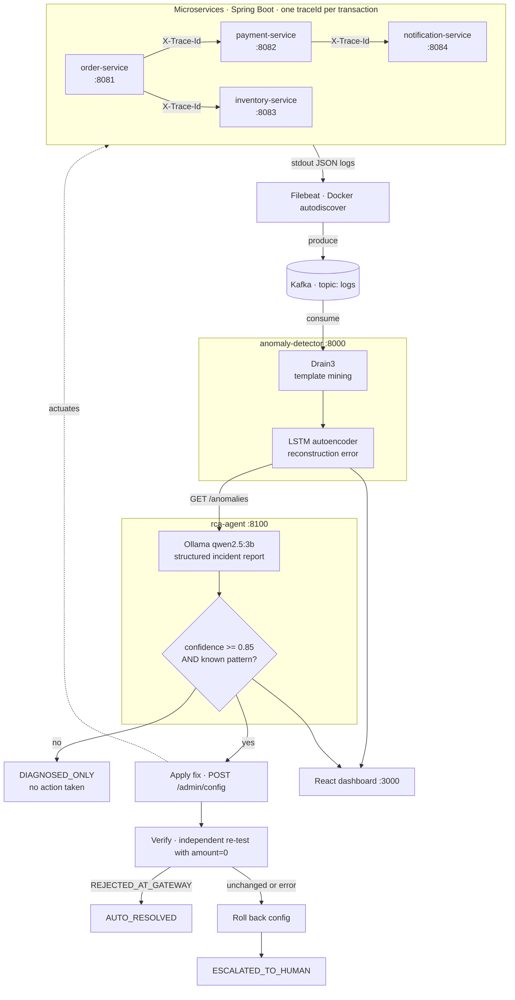

# AI-Ops: Autonomous Log Anomaly Detection & Root Cause Analysis

**A self-hosted system that detects microservice failures, diagnoses their root cause with a local LLM, and — for a known failure pattern — applies a real fix, verifies it worked, and rolls back if it didn't. Zero paid APIs; everything runs on one laptop.**

---

## The problem

In a microservice architecture, every service logs independently. When a request fails, the evidence is scattered across four different log streams with no shared thread tying them together, so an engineer has to manually correlate timestamps across services to reconstruct what happened. Worse, the failures that matter most are often *logic-level*: nothing crashes, no stack trace appears, and a keyword alert on `ERROR` sees nothing at all — an order is silently declined, a step is skipped, a call quietly gets slower. Those are invisible to grep and expensive to find by hand.

This project builds the full loop that closes that gap: correlate, detect, diagnose, and — where it is safe to do so — fix.

---

## What it does

- **Distributed tracing across 4 real microservices** — a `traceId` is generated at the gateway and propagated across every service hop, so one business transaction is recoverable as a single ordered sequence.
- **Real-time log streaming** — structured JSON logs are shipped off every container and into a central Kafka topic without any application code changing to support it.
- **ML-based anomaly detection, not keyword matching** — Drain3 mines raw log lines into stable templates, and an LSTM autoencoder trained *only on normal traffic* scores each trace by reconstruction error. It flags sequences that are structurally unusual, including ones where no line says "ERROR".
- **AI root cause analysis, fully local** — a quantized 3B model (Ollama + `qwen2.5:3b`) receives the trace, the service dependency graph, and the anomaly score, and returns a structured incident report: root cause, affected services, confidence, suggested fix, and its reasoning.
- **Closed-loop auto-remediation** — for a demonstrated failure pattern, the agent applies a real configuration fix, **independently re-tests** to confirm the fix actually worked, and **automatically rolls back** if verification fails. Every action is gated behind a confidence threshold, so low-confidence diagnoses are never acted on.
- **Live operations dashboard** — service topology with health coloring, an anomaly timeline with full log context, incident report cards, a remediation audit log, and one-click buttons to trigger real failures for demos.

---

## Architecture



The remediation path is the part worth reading closely: the agent does not stop at *suggesting* a fix. It applies one, proves it worked with a test it runs itself, and undoes its own change if the proof fails.

---

## Tech stack

| Layer | Technology |
|---|---|
| Microservices | Java 17, Spring Boot 3.3.2 |
| Distributed tracing | SLF4J MDC + servlet filter + `RestTemplate` interceptor (hand-rolled) |
| Structured logging | Logback + `logstash-logback-encoder` (JSON to stdout) |
| Log shipping | Filebeat 8.13.4 (Docker autodiscover, `json-file` driver) |
| Message bus | Apache Kafka 7.6.1 (Confluent images) + ZooKeeper |
| Log parsing | Drain3 0.9.11 (online log template mining) |
| Anomaly detection | PyTorch 2.3.1 — LSTM sequence autoencoder (CPU) |
| LLM inference | Ollama + `qwen2.5:3b`, fully local |
| Backend services | Python 3.11, FastAPI 0.111, `kafka-python` |
| Frontend | React 18.3, Vite 5.4, served by nginx 1.27 |
| Orchestration | Docker Compose — 13 services on one bridge network |

---

## Proof it works

These are figures observed in real runs of the system, not projections. The trained model, its threshold, and the Drain3 state are all committed, so a fresh clone reproduces this behavior without retraining.

**Anomaly detection**
- Model: LSTM autoencoder, **16,098 trainable parameters**, 67 KB on disk — small enough to train on a laptop CPU in seconds.
- Trained on **161 real captured trace sequences** of normal traffic.
- Learned threshold: **0.2927** (training-set mean 0.1490 + 3σ of 0.0479).
- Real failures scored clearly above it: **0.322** for an out-of-stock cascade, **0.346** for an invalid-amount payment decline. The margin between normal and anomalous is real, not marginal.

**Root cause analysis**
- The local 3B model produced correct, well-reasoned reports — e.g. correctly identifying `inventory-service` as the origin of an out-of-stock cascade at **0.90 confidence**, listing all four affected services in call order, and proposing a relevant fix.
- Observed confidence across runs ranged **0.80 – 1.00** on the same failure pattern, which is exactly why actions are gated rather than assumed correct.

**Closed-loop remediation — all three outcomes demonstrated live**

| Outcome | How it was demonstrated | Result |
|---|---|---|
| `AUTO_RESOLVED` | High-confidence diagnosis → applied gateway fix → independent re-test returned `REJECTED_AT_GATEWAY` | Fix verified working; a subsequent unrelated request was correctly rejected |
| `DIAGNOSED_ONLY` | A real run where the LLM returned **0.80 confidence**, below the 0.85 action threshold | System correctly took **no action** and logged why — the safety gate firing on its own, unprompted |
| `ESCALATED_TO_HUMAN` | (a) fix could not be applied at all; (b) fix applied but re-test still showed old behavior | (a) escalated with nothing to undo; (b) **config automatically rolled back**, then escalated |

Every attempt — including the ones where it declined to act — is written to an auditable `remediationLog` with the request and response bodies of each step.

**Cost and privacy**
- Runs entirely on the host. No API keys, no recurring cost, and no log data leaves the machine.

---

## Quick start

**Prerequisites:** Docker Desktop (or Docker Engine + Compose v2), roughly 8 GB free RAM and 5 GB free disk.

```bash
git clone https://github.com/yuvrajpawar09/AI-Ops.git
cd AI-Ops
docker compose up -d --build
```

On the **first run only**, a helper container pulls the `qwen2.5:3b` model (~2 GB) into a named Docker volume. This takes a few minutes; the dashboard and detection pipeline come up before it finishes, and the RCA agent waits for it automatically.

Watch for everything to become healthy:

```bash
docker compose ps
```

Then open **<http://localhost:3000>** and click a trigger button under **Manual Trigger**.

> **No training step required.** The trained model, threshold, and Drain3 template state are committed, so anomaly detection is live on first boot. To retrain on your own traffic instead:
> ```bash
> docker compose run --rm anomaly-detector python -m training.train
> docker compose restart anomaly-detector
> ```

**Service endpoints**

| Service | URL |
|---|---|
| Dashboard | <http://localhost:3000> |
| Orders API | `POST http://localhost:8081/orders` |
| Anomalies | <http://localhost:8000/anomalies> |
| Incident reports | <http://localhost:8100/incidents> |
| Runtime config | <http://localhost:8081/admin/config> |

---

## Demo walkthrough

The dashboard's **Manual Trigger** panel fires real requests through the live system — no mocking.

| Button | What it sends | What it demonstrates |
|---|---|---|
| **Normal order** | `PROD-1`, qty 1, amount 199.0 | The happy path: all four services participate, one shared `traceId`, no anomaly raised. Establishes the baseline the LSTM was trained on. |
| **Out-of-stock order** | `PROD-3`, qty 5 (only 2 seeded) | A *partial failure*: payment succeeds but inventory reservation fails, leaving an inconsistent state. Flagged at ~0.32; the RCA agent traces the cascade back to `inventory-service`. |
| **Payment failure** | amount `0` | The auto-remediation scenario. An invalid amount travels the whole call chain before being declined deep in `payment-service`. Flagged at ~0.35 — and if the diagnosis clears the confidence gate, the agent installs a gateway validation fix, verifies it, and the same request is rejected immediately thereafter. |

Watch the **Remediation Actions** panel to see the outcome badge and the full step-by-step action log for each incident.

---

## Project structure

```
AI-Ops/
├── services/                 # 4 Spring Boot microservices (Java 17)
│   ├── order-service/            # entry point; gateway validation + /admin/config actuation
│   ├── payment-service/          # calls notification-service on success
│   ├── inventory-service/        # in-memory stock, deliberate low-stock product for demos
│   └── notification-service/     # leaf service
├── log-pipeline/             # Filebeat -> Kafka config, plus a standalone consumer test script
├── anomaly-detector/         # FastAPI service: Drain3 template mining + LSTM autoencoder
│   ├── app/                      # consumer, feature extraction, model, scoring, API
│   ├── training/                 # train.py — trains on captured normal traffic
│   └── models/                   # committed artifacts: weights, threshold, Drain3 state
├── rca-agent/                # FastAPI service: Ollama-backed RCA + closed-loop remediation
│   └── app/                      # prompt, LLM client, analyzer, remediation, audit store
├── dashboard/                # React + Vite ops dashboard, served by nginx
└── docker-compose.yml        # 13 services on a shared bridge network
```

---

## Design decisions worth highlighting

- **Hand-rolled distributed tracing (MDC + servlet filter + client interceptor)** rather than pulling in Sleuth or OpenTelemetry — the same mechanism those libraries use internally, but written explicitly so every step of propagation is visible and explainable.
- **Drain3 + LSTM instead of keyword matching** — template mining makes the vocabulary finite and learnable, and reconstruction error catches *structural* anomalies (missing steps, wrong ordering, timing drift) that no `ERROR` keyword rule would ever fire on.
- **Trained only on normal traffic (unsupervised)** — no labeled anomaly dataset is required, which is what makes the approach realistic for systems where you can't enumerate failures in advance.
- **A template the model has never seen still scores as anomalous automatically** — its embedding row was never updated during training, so it reconstructs poorly. This falls out of the architecture rather than needing a special-case rule.
- **Polling over WebSockets for the dashboard** — the upstream pipeline is already multi-second end to end (Kafka propagation, an 8s trace-idle window, then LLM inference), so push adds no meaningful latency while requiring new server-side infrastructure. Polling also keeps each panel's failure domain independent: one backend going down degrades exactly one panel.
- **Confidence-gated autonomy** — the remediation loop acts only above a 0.85 threshold *and* only when the diagnosis matches a known pattern, always verifies with an independent test, and always has a rollback path. Autonomy is scoped deliberately rather than assumed.

---

## Honest limitations

- **Training data is synthetic and small.** The model learned from ~161 self-generated trace sequences on a 4-service system, not diverse production traffic. It has not been validated against workload patterns it didn't generate itself.
- **No formal precision/recall benchmark.** The figures above are observed behavior from real runs, not evaluation metrics against a labeled dataset. Detection quality is demonstrated, not statistically characterized.
- **The dependency graph is static.** Service topology is hard-coded to match the real call chain rather than discovered from traffic, so the graph would need updating by hand if services were added.
- **Auto-remediation covers one well-understood failure pattern**, not a general capability. The fix, the verification test, and the pattern match are all specific to the invalid-amount scenario. Generalizing this is genuinely hard and is deliberately not claimed.
- **A 3B local model is far weaker than frontier models.** It occasionally varies its confidence on identical evidence (0.80–1.00 observed on the same pattern) and can misdiagnose. This is precisely why every action is confidence-gated, independently verified, and reversible — the architecture assumes the model is fallible.
- **The `/admin/config` endpoint is unauthenticated** and CORS is fully open. Both are appropriate for a local demo and both are deliberate; a production deployment would require an auth boundary on the actuation path.

---

## Roadmap

- Benchmark detection precision/recall against a public dataset (e.g. LogHub / HDFS, BGL) to replace observed behavior with measured metrics.
- Generalize remediation beyond a single pattern — a small library of pattern/fix/verification triples with a common safety wrapper.
- Discover the service dependency graph dynamically from observed `traceId` call sequences instead of declaring it statically.
- Persist anomalies and incidents to a datastore so history survives restarts and can be analyzed over time.
- Add a human approval queue so medium-confidence diagnoses can be actioned with one click rather than only auto-resolved or dropped.

---

## License

Released under the MIT License — see [LICENSE](LICENSE) for the full text.

Copyright (c) 2026 Pawar Yuvraj
