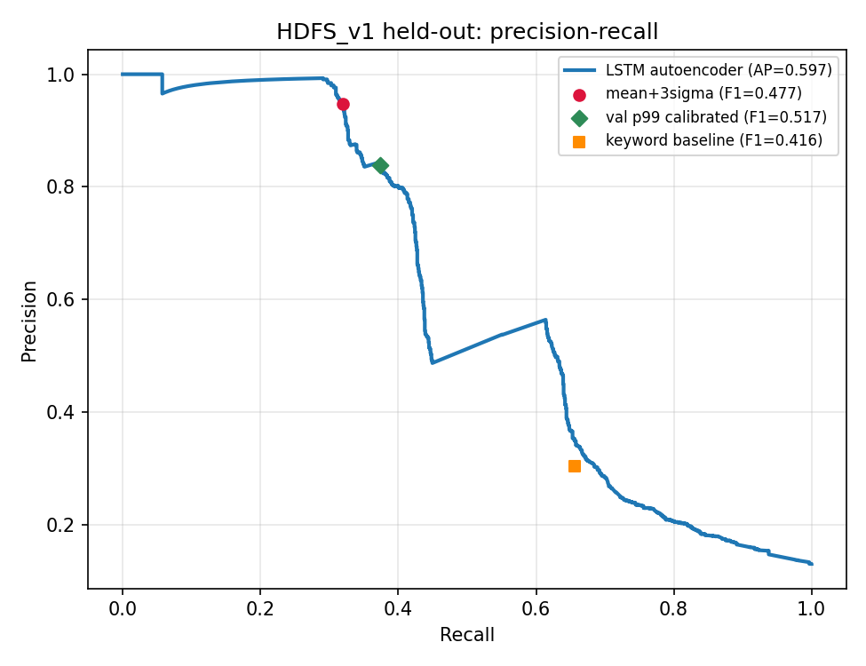
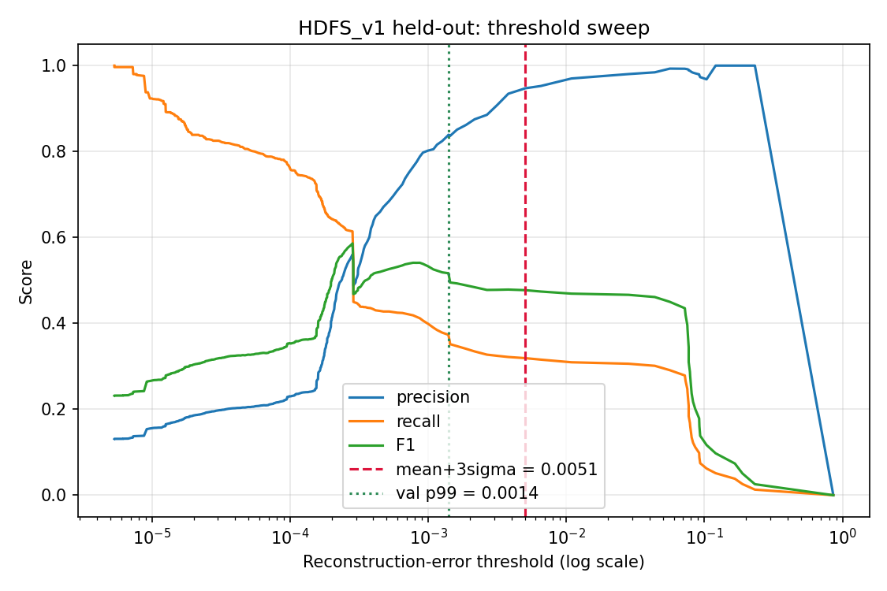

# Benchmark results

Two evaluations: an **offline benchmark on a public labeled dataset** (LogHub HDFS_v1) and an **end-to-end fault-injection benchmark** against the live system. All numbers below come from real runs on the committed code; nothing is projected or hand-tuned.

Hardware: Windows 11 laptop, Docker Desktop (WSL2 backend), CPU-only. `torch==2.3.1+cpu`, `drain3==0.9.11` — the same pins the `anomaly-detector` image ships.

---

## Part A — LogHub HDFS_v1 (labeled, offline)

**Feature version: v1.** Part A was run before the v2 feature work and has not been re-run; the v2 features target inter-service timing, which HDFS's second-resolution timestamps largely cannot express (see *Adaptations*).

### Dataset

| | |
|---|---|
| Source | `https://zenodo.org/records/8196385/files/HDFS_v1.zip` (186 MB) |
| Full dataset | 575,061 labeled blocks, 16,838 anomalous (**2.928%**) |
| Subsample used | **50,000 blocks, 1,464 anomalous (2.928%)** — natural ratio preserved |
| Lines retained | 970,180 of 11,175,629 scanned |
| Drain3 templates mined | **19** (well under the 128 embedding cap, so no OOV truncation) |
| Unparsable lines | **0** |
| Model | LSTM autoencoder, **16,098 parameters**, 67 KB |
| Split | 33,974 train (normal only) / 4,854 validation (normal only) / **11,172 test (9,708 normal + 1,464 anomaly)** |

Thresholds are selected on **train** or **validation normals only**. Test labels are never used to pick an operating point.

### Headline

**ROC-AUC 0.7930 · Average precision 0.5974**

### Operating points

| Operating point | Threshold | Precision | Recall | F1 | FPR |
|---|---|---|---|---|---|
| Production rule (train mean + 3σ) | 0.0051 | 0.947 | 0.319 | 0.477 | 0.003 |
| Validation p95 (5% FPR budget) | 0.0003 | 0.582 | 0.438 | 0.500 | 0.047 |
| **Validation p99 (1% FPR budget)** | 0.0014 | **0.839** | 0.374 | **0.517** | 0.011 |
| Validation p99.9 (0.1% FPR budget) | 0.0282 | 0.980 | 0.306 | 0.466 | 0.001 |
| **Keyword baseline** (`ERROR\|WARN\|Exception`) | — | 0.304 | **0.656** | 0.416 | **0.227** |

### Confusion matrices (test: 9,708 normal / 1,464 anomaly)

| Operating point | TN | FP | FN | TP |
|---|---|---|---|---|
| mean + 3σ | 9,682 | 26 | 997 | 467 |
| validation p95 | 9,247 | 461 | 823 | 641 |
| validation p99 | 9,603 | 105 | 917 | 547 |
| validation p99.9 | 9,699 | 9 | 1,016 | 448 |
| keyword baseline | 7,508 | **2,200** | 503 | 961 |

### Where the LSTM beats keyword matching

Not on recall — keyword matching has **higher** recall (0.656 vs 0.374). The difference is **false alarms**:

- Keyword baseline flags **2,200 of 9,708 healthy blocks — a 22.7% false-positive rate.**
- The LSTM at validation-p99 flags **105 — 1.1%.**

That is roughly a **21× reduction in false alarms** at 2.8× the precision. A detector that fires on nearly a quarter of healthy traffic gets muted in a week.

The LSTM also dominates at matched recall: at the keyword baseline's own recall of 0.656, the LSTM achieves precision **0.350 vs 0.304**.

Precision/recall trade available from the model:

| Target precision | LSTM recall |
|---|---|
| 0.90 | 0.327 |
| 0.80 | 0.400 |
| 0.60 | 0.436 |
| 0.40 | 0.644 |

*Diagnostic only, not an operating point:* the best F1 achievable anywhere on the test set is **0.5860** at threshold 0.0003. Reported to show the gap between our label-free calibration and an oracle; it is not used to select anything.




### Adaptations made for HDFS

The benchmark imports the **production** `build_sequence_tensor` and `LogSequenceAutoencoder` directly. Only the inputs are adapted:

| Field | Our microservices | HDFS | Adaptation |
|---|---|---|---|
| Trace key | `traceId` | `BlockId` (`blk_-?\d+`) | direct equivalent |
| Service | 4 named services | `component` (e.g. `dfs.FSNamesystem`) | top-4 components mapped to service ids 1–4, rest to the unknown bucket 0 |
| Level | INFO / WARN / ERROR | INFO / WARN / ERROR | unchanged |
| Timestamp | millisecond | **second** resolution | unchanged, but most inter-arrival values collapse to 0 — a real loss of signal |
| Sequence length | 10-line happy path, `MAX_SEQ_LEN=16` | ~19 lines/block average | blocks are truncated at 16; the tail is lost |

Drain3 uses the same `drain3.ini` as production but an **in-memory** miner, so the committed `drain3_state.bin` is never mutated.

### Honest read

ROC-AUC 0.79 is **moderate, not strong**. Recall caps near 0.44 before precision collapses. A 16K-parameter model carried into a foreign domain — with second-resolution timestamps and 16-event truncation on ~19-line blocks — is not competitive with purpose-built HDFS detectors; published DeepLog-class results on HDFS reach F1 > 0.9. The honest claim is that the approach **transfers with degraded but real signal**, and that it dominates the keyword baseline on the axis that matters operationally.

---

## Part B — End-to-end fault injection (live system)

400 labeled orders through the running stack: **300 normal + 4 fault types × 25**. rca-agent is stopped and stock reset so remediation cannot alter the system mid-measurement. Ground truth is the traceId returned by each order.

### Pipeline integrity (gate for the whole benchmark)

| Check | Result |
|---|---|
| Delivery complete (emitted → Kafka within idle window) | **400/400 = 100.000%** |
| Assembly complete (detector event count == lines emitted) | **75/75 = 100.000%** |
| **Split closures** (trace scored as >1 fragment) | **0** (required: 0) |
| Duplicate traceIds in store | **0** |
| Late lines merged by the grace window | 28 |
| Kafka arrival spread | median 0.01 s · p95 2.55 s · max 2.56 s |

Max arrival spread (2.56 s) sits well inside the **unchanged 8 s** idle timeout.

### Results — one clean run

| | **v1 (shipped default)** | v2 (experimental, opt-in) | Keyword |
|---|---|---|---|
| Precision | 0.8889 | 0.9009 | **1.0000** |
| Recall | 0.8000 | **1.0000** | 0.7500 |
| **F1** | 0.8421 | **0.9479** | 0.8571 |
| FPR | **0.0333** | 0.0367 | **0.0000** |

Confusion — v1: tp=80 fp=10 fn=20 tn=290 · v2: tp=100 fp=11 fn=0 tn=289

### Per-fault recall

| Fault type | n | v1 | **v2** | Keyword |
|---|---|---|---|---|
| `amount_zero` | 25 | 1.000 | 1.000 | 1.000 |
| `notification_down` | 25 | 1.000 | 1.000 | 1.000 |
| `out_of_stock` | 25 | 1.000 | 1.000 | 1.000 |
| **`inventory_latency`** | 25 | 0.200 | **1.000** | 0.000 |
| `normal` (false-positive rate) | 300 | 0.033 | 0.037 | 0.000 |

All four fault types genuinely manifested: `amount_zero` → 25 × `FAILED`, `out_of_stock` → 25 × `INVENTORY_FAILED`, `notification_down` and `inventory_latency` → 25 × `COMPLETED` each (silent failures), `normal` → 300 × `COMPLETED`.

### v1 → v2 promotion

**v2 features:** inter-arrival switched from `min(dt/5, 5)` to `log1p(dt)` with a wide clip, plus a per-trace **total-duration** channel (`CONT_FEATURE_DIM` 2 → 3). v1's squash saturated — a 2.5 s stall and a 25 s stall both landed near the top of the range, and 2.5 s only reached 0.5 while competing with 12 embedding dimensions.

**Training:** 1,000 train + 300 validation **normal** orders, entirely separate from the Part B set and deliberately varied — PROD-1/PROD-2, quantities 1–10, amounts 10–5000, 250 distinct customer ids, and a mix of paced and burst (concurrent) sending. 100% of harvested training traces were complete 10-line sequences.

**Threshold:** `max(validation p99, validation mean + 3σ)` — the same family of label-free rule used in Part A.

| | value |
|---|---|
| validation p99 | 4.123e-06 |
| validation mean + 3σ | **6.913e-06** ← chosen (floor won) |
| train mean / std | 1.806e-06 / 6.991e-06 |

**Promotion rule, fixed before the run:** promote only if v2's FPR is within 2 points of v1 **and** latency recall stays above 0.80.

| Condition | Measured | Verdict |
|---|---|---|
| FPR within 2 points | v1 0.0333 → v2 0.0367 = **+0.33 pts** | **PASS** |
| Latency recall > 0.80 | **1.000** | **PASS** |

**Both conditions passed, and v2 was briefly promoted — then reverted.** A post-promotion fresh-clone check caught a failure the rule could not see; see *Fresh-clone check* below. **v1 is the shipped default.** v2 ships alongside as an opt-in experiment:

```bash
FEATURE_VERSION=v2 MODEL_PATH=/app/models/lstm_autoencoder_v2.pt THRESHOLD_PATH=/app/models/threshold_v2.json
```

### Fresh-clone check — why v2 was reverted

The Part B figures above are a **single run** and that same run decided the promotion, so it is not an independent hold-out. A separate check on a freshly started stack exposed the gap.

| Check | v2 | v1 |
|---|---|---|
| First (cold) order after startup | **flagged** (score 0.00311 vs threshold 6.9e-06) | **not flagged** |
| 12 warm normal orders | **1 of 12 flagged** | **0 of 12 flagged** |
| `amount_zero` | flagged | flagged (0.34593) |
| PROD-3 over-order | not tested | flagged (0.32187) |

The cold-start trace v2 flagged was **structurally perfect** — 10 events, correct service order, all INFO. It was merely slow: 0.253 s total with a 79 ms maximum gap, against ~0.018 s / ~0.011 s warm, because the JVM had been running for 9 seconds. v2's entire premise is timing sensitivity, so ordinary warm-up reads as an anomaly. On a demo that means the **first order after `docker compose up` is likely to be flagged**.

**Memory confound — the comparison is not clean.** The v2 check ran with Docker capped at **7.6 GB**, which was causing container OOM kills (`exit 137` on `kafka` and `anomaly-detector`, and two Docker Desktop crashes). The v1 check ran after raising the cap to **10 GB**. A memory-starved host slows JVM startup and GC, which is exactly the signal v2 keys on, so part of v2's cold-start sensitivity may be attributable to the host rather than the model. **v2 was not retested at 10 GB.** v1's pass is solid on its own terms; the v1-vs-v2 cold-start comparison is confounded and should not be read as a clean verdict on v2.

### Lesson: the promotion rule had no absolute false-positive ceiling

The rule was *relative* — "v2's FPR within 2 points of v1's" — and v2 passed it at +0.33 points. But a relative rule cannot catch a model whose errors are concentrated in a situation the benchmark never samples. Part B warms the stack with hundreds of orders before measuring, so **cold-start traffic was absent from the evaluation set entirely**. A rule of the form "and FPR must not exceed X% in absolute terms, measured including cold start" would have caught this; the one we fixed in advance could not.

### Honest read

On **our own** system the keyword baseline is strong — precision 1.000 and zero false positives — because our four services have a small, disciplined vocabulary and only log WARN/ERROR on genuine failures. v2 beats it on F1 (0.9479 vs 0.8571, single run, experimental) and catches **every** injected fault, but the margin comes almost entirely from `inventory_latency`: the one fault that emits **no** WARN or ERROR line at all. That is precisely the class of silent, logic-level failure this project exists to catch, and the contrast with HDFS (where keyword matching had a 22.7% FPR) shows how much the baseline's apparent strength depends on log hygiene.

A single 300-sample run gives a noisy FPR estimate. Earlier v1 runs under identical protocol produced FPRs between 0.0067 and 0.0500 — treat all FPR figures here as ±2 points.

---

## Part C — GPU acceleration for the LLM

The RCA agent's LLM call was the slowest stage in the whole system. Measured with an identical, realistic RCA prompt (~700 prompt tokens, JSON-constrained output), model warm in both cases so cold-load is excluded, 3 reps each.

| | CPU | **GPU (RTX 3050 6 GB)** | Speedup |
|---|---|---|---|
| Mean wall per incident report | **47.07 s** | **4.21 s** | **11.2×** |
| Range | 46.78 – 47.23 s | 2.91 – 6.55 s | |
| Generation throughput | 16.6 tok/s | **66.0 tok/s** | 4.0× |

Ollama reports `offloaded 37/37 layers to GPU`, model buffer 1,834 MiB — the 3B model fits comfortably in 6 GB.

**The wall-clock speedup (11.2×) is larger than the generation speedup (4.0×)** because prompt evaluation also moves to the GPU. At ~700 prompt tokens the prefill, not the decode, was the dominant CPU cost — visible in the CPU numbers, where only ~8–10 s of the 47 s was token generation.

This directly removes the failure we hit during Phase 4, where a cold-start model reload exceeded a 120 s timeout. Enabled via a `deploy.resources.reservations.devices` block on the `ollama` service; delete that block to fall back to CPU on a machine without an NVIDIA GPU.

---

## Superseded and invalid results

These were measured and are recorded here **only** so the record is honest. They must not be quoted.

| Run | Reported | Why invalid |
|---|---|---|
| Part B, pre-partition-fix | P 0.842 / R 0.800 / F1 0.821, 15 FPs | Filebeat used `partition.round_robin`, spraying one trace's lines across 3 partitions that drain independently. Traces closed mid-assembly and were scored truncated. **All 15 false positives were truncation artifacts** — verified against raw container logs (trace emitted 10 lines, detector scored 5). The 5 "detected" latency traces were the same artifact, so true latency recall was ~0, not 0.200. |
| Part B, post-partition / pre-scorer-fix | P 0.9759 / R 0.810, 2 FPs | Both remaining false positives were **split closures**: a trace closed on its first lines, then the remainder reopened as a second fragment (`0240bbd0` was scored twice, 2 + 8 = 10 events). |
| Part B, dual-detector first attempt | all zeros | Harness bug: polled `/anomalies?limit=2000` against an endpoint capped at `le=500`, so every poll returned HTTP 422 and was silently swallowed. Detectors were healthy throughout. |
| v2 attempt 1 (homogeneous training) | F1 0.8475, FPR 0.1200 | Trained on 1,000 structurally identical orders; training loss reached 0.000000 and the error distribution collapsed, so validation p99 (8.66e-07) was effectively zero-tolerance. Calibration predicted 1% FPR and delivered 12%. Fixed by diverse training traffic plus a mean+3σ floor. |

**Two pipeline bugs were found and fixed through this benchmark**, both invisible to the application and to the model:

1. **Round-robin partitioning** split a trace's lines across Kafka partitions → systematic truncation at ~10 s delivery-batch boundaries. Fixed by keying each event with a `pkey` field (traceId, or `no-trace` for infrastructure lines) and hash-partitioning, so one trace always lands in one partition. The fallback deliberately uses a **separate** field so infrastructure lines are not merged into a fake shared trace.
2. **Split closures** — late-arriving remainders of an already-closed trace were scored as standalone fragments. Fixed by retaining closed traces for a 60 s grace window, merging late lines, rescoring the whole trace and **replacing** the earlier entry (`AnomalyStore.upsert` / `remove`). The idle timeout stays at 8 s.

---

## Reproducing

Use `docker compose down` rather than `stop` between full-stack cycles — `stop` leaves Zookeeper's state in place, and Kafka's broker re-registration then fails with `NodeExistsException` (there is also a bounded `restart: on-failure:3` on Kafka as a safety net).

```bash
# dependencies (torch pinned to the same version the detector image ships)
python -m venv .venv && .venv/Scripts/pip install -r benchmark/requirements.txt

# Part A - offline, needs no running stack. Stop containers first to free RAM.
docker compose down
python benchmark/download_hdfs.py --blocks 50000
python benchmark/run_hdfs_benchmark.py

# Part B - needs the full stack
docker compose up -d --build
python benchmark/run_fault_injection.py

# optional: retrain v2 on fresh diverse traffic
python benchmark/train_v2.py --train 1000 --val 300
```

Outputs land in `benchmark/results/`: `hdfs_results.json`, `fault_injection_results.json`, and the two PNGs. The raw HDFS download and the derived tensor caches are gitignored.

---

## Not done / roadmap

- **Sequence-length ablation (16 / 32 / 64).** Plumbed in `run_hdfs_benchmark.py` via `--seq-len`, which overrides `MAX_SEQ_LEN` in-process without touching production config. Not run.
- **Re-run Part A with v2 features.** HDFS's second-resolution timestamps blunt exactly what v2 adds, so the expected gain is small; Part A is labeled v1 rather than mixing feature versions in one table.
- **Repeat Part B n times** for confidence intervals on FPR. Single 300-sample runs are noisy (observed v1 FPR range 0.0067–0.0500).
- **Retrain v2 with cold-start-inclusive validation and an absolute threshold floor.** The validation set should contain traffic from the first seconds after startup, and the threshold rule should carry a hard floor so it cannot collapse toward zero when training error does. Re-test at the 10 GB memory cap to remove the confound above.
- **Multi-trace / windowed detection.** Every fault here is visible inside a single trace; correlated failures spanning traces are not modeled.
